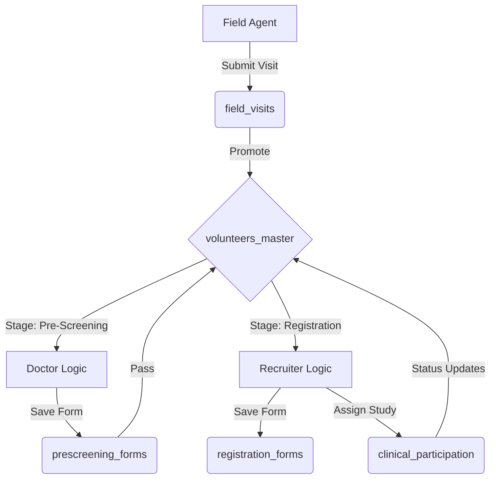

# System Flow & Logic Guide

This document outlines the end-to-end flow of the application, detailing how data moves from the field agent's tablet all the way to clinical study management.

## 1. The Field Visit (Entry Point)
**Actor:** Field Agent  
**Goal:** Capture potential volunteer data.

1.  **Data Entry**: Agent fills out the "Field Visit Form" on their mobile device.
    *   *Logic*: Checks for duplicate phone numbers (`contact` index).
2.  **Submission**:
    *   **Draft Mode**: Saved to `field_visits` collection.
    *   **Final Submit**:
        *   Data is validated.
        *   A new record is created in `volunteers_master`.
        *   **Atomic ID Generation**: A unique ID (e.g., `MUV0001`) is generated using the `counters` collection.
        *   *Status*: `current_stage` set to `pre_screening`.

## 2. Pre-Screening (Medical Filter)
**Actor:** Doctor / Recruiter  
**Goal:** Determine if the volunteer is healthy enough for studies.

1.  **Dashboard View**: Users see a list of volunteers in "Pre-Screening" stage.
2.  **Action**: User opens the volunteer profile and fills the "Pre-Screening Form".
    *   *Data*: Medical history, allergies, current medications.
3.  **Outcome**:
    *   **Pass**: Form saved to `prescreening_forms`. Volunteer moved to `registration` stage.
    *   **Fail**: Volunteer marked as `rejected` or `ineligible`.

## 3. Registration & Consent
**Actor:** Recruiter  
**Goal:** Formal enrollment and legal consent.

1.  **Dashboard View**: Users see a list of volunteers in "Registration" stage.
2.  **Action**:
    *   Collect Insurance Info.
    *   **Consent**: Digital signature captured.
    *   **Study Selection**: Recruiter selects eligible studies from `clinical_studies`.
3.  **Logic**:
    *   System checks if volunteer is already active in a conflicting study.
    *   Form saved to `registration_forms`.
    *   Entries created in `clinical_participation` for each selected study.
    *   **Status Update**: Volunteer moved to `clinical_assignment` stage.

## 4. Clinical Participation (The Loop)
**Actor:** Clinical Staff / Doctor  
**Goal:** Manage active study participation.

1.  **Study Dashboard**: Doctors view participants grouped by `study_code`.
2.  **Tracking**:
    *   Status updates: `assigned` → `screened` → `enrolled` → `active` → `completed`.
    *   Notes and observations added to `clinical_participation` record.
3.  **Completion**:
    *   When a study is finished, the participation record is marked `completed`.
    *   If all studies are done, `volunteers_master` can be archived or marked `program_completed`.

## 5. Management & Analytics (Oversight)
**Actor:** Manager / Admin  
**Goal:** Performance tracking and high-level metrics.

*   **Real-time Dashboards**: Query `volunteers_master` indexes for fast counts.
    *   "How many visits today?" (Date filter)
    *   "Conversion Rate?" (Visits vs. Enrollments)
*   **Audit Trail**: Every action above writes to `audit_logs` for compliance.

## Technical Data Flow Summary

